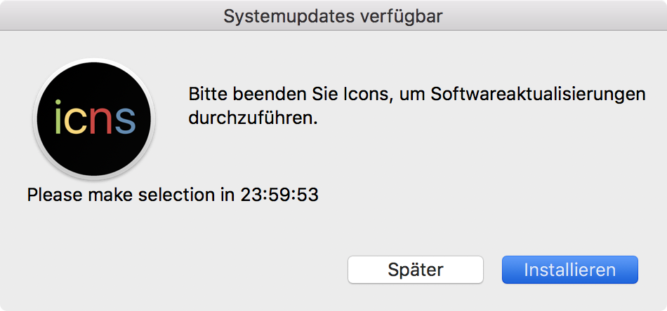
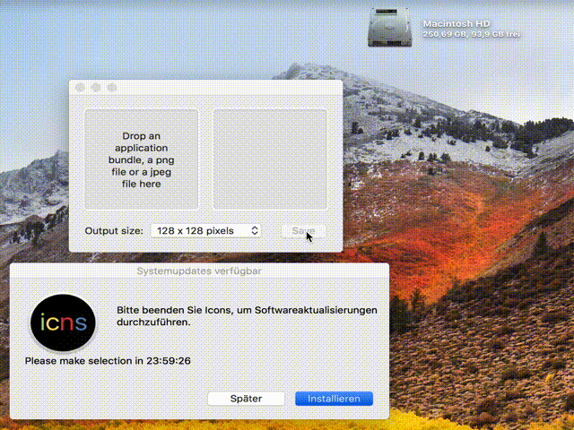
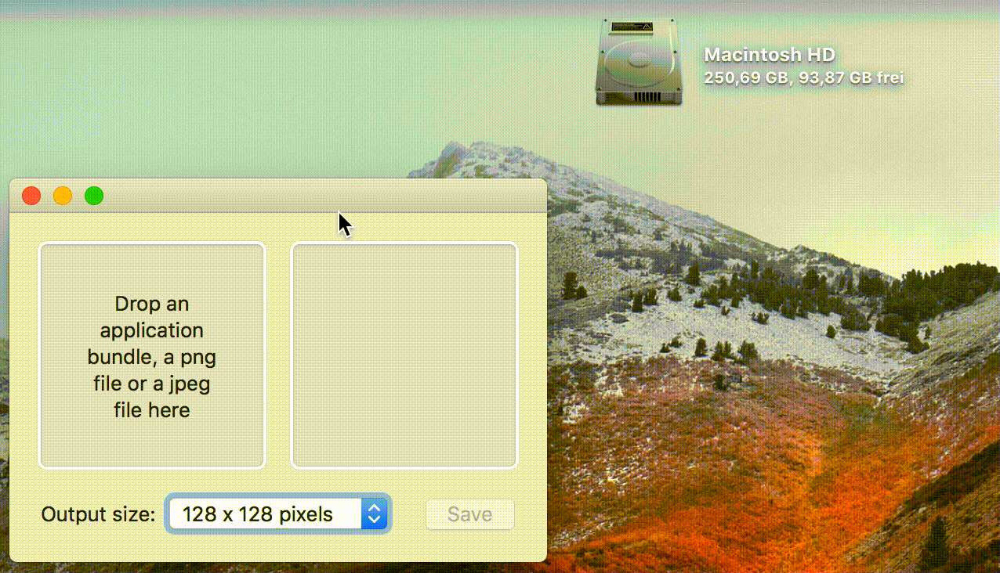

# Magic Installer

## Description

This script will help you to install software silently on your Macs with [Jamf Pro](https://www.jamf.com).

To download updates for your applications, consider [AutoPkg](https://github.com/autopkg/autopkg).

The idea and some part of the code came from [auto-update-magic](https://github.com/homebysix/auto-update-magic).

Unlike other projects, only one policy per package is needed here (n+0). For auto-update-magic you need n+1 policies. For other internal projects we needed n*2 policies.

**Feel free to open an issue or upload a pull request.**

## Problem

When you deploy software to your macs, you have to handle multiple challenges.

- check if the app is running
- is the app newer than the app I want to install
- inform the user, that the an installation is running

Most of these challenges are not covered by Jamf Pro.

The new "patch management" will check the version, but installs the package even if the app is running. You can configure Jamf Pro to force quit these applications, but this is not smooth.

But what if you will install a software, which is not covered by the patch management? This script will help you to install it with a classic policy.

## What does it do

### magic_installer_container.sh

This script will copy the base64-embedded `magic_installer.sh` to the desired path. It also install a LaunchDaemon, which starts the script `magic_installer.sh` every 10 seconds. The Parameter 4-11 will be passed to the script.

### magic_installer.sh

This script compares the version numbers from the installed app with the version number from the package. If the package version is the same or older, then the script will delete the LaunchDaemon and quit itself.

If the installed version is older, then the script will do some other checks. The installer will start immediatly, if the given process name is not running. That's also the case if no one is logged in.

If the app is running and a deadline is set, then a message will appear.

The user can postpone the message. The default idle time is 24h, 4h, 2h, 30min, 5min. If the user clicks the button or the timer runs out, the given prozess will quit via applescript. If this fails, the prozess will be killed.

If the user postponed the message and later quits the app manually, the installation will start immediatly.

If the app is running and no deadline is set, the script will quit. It will restart automatically by the LaunchDaemon. In practise the script will "wait" with the installation until the user quit the desired application.

## Installation

Add a new script in Jamf Pro, copy the content from `magic_installer_container.sh` to it and add a couple of "options".

| Key      | Value                        |
|----------|------------------------------|
| Name     | magic_installer_container.sh |
| Priority | After                        |

| Label        | Text                                       |
|--------------|--------------------------------------------|
| Parameter 4  | Processname (use ; as delimiter)           |
| Parameter 5  | appVersion (Optional)                      |
| Parameter 6  | Displayname (Optional)                     |
| Parameter 7  | PKGs to install (use ; as delimiter)       |
| Parameter 8  | deadline (Optional)                        |
| Parameter 9  | icon (Optional)                            |
| Parameter 10 | appVersionOld Path Info.plist (Optional)   |
| Parameter 11 | appVersionOld Plist-Key (Optional)         |

Add a policy and **cache** the desired packages. Also add the Script `magic_installer_container.sh` to the policy and fill the parameters.

### Example

#### General

| Key                 | Value              |
|---------------------|--------------------|
| Name                | Firefox ESR 60.2   |
| Trigger             | Recurring Check-in |
| Execution Frequency | Once every day     |

#### Packages

| Key    | Value                       |
|--------|-----------------------------|
| Name   | Mozilla-FirefoxESR-60.2.pkg |
| Action | Cache                       |
| Name   | Mozilla-Firefox-Config.pkg  |
| Action | Cache                       |

#### Scripts

| Key                           | Value                                                  |
|-------------------------------|--------------------------------------------------------|
| Name                          | magic_installer_container.sh                           |
| Priority                      | After                                                  |
| Processname                   | Firefox                                                |
| appVersion                    | 60.2.0                                                 |
| Displayname                   |                                                        |
| PKGs to install               | Mozilla-FirefoxESR-60.2.pkg;Mozilla-Firefox-Config.pkg |
| deadline                      |                                                        |
| icon                          |                                                        |
| appVersionOld Path Info.plist | /Applications/Firefox.app/Contents/Info.plist          |
| appVersionOld Plist-Key       |                                                        |

#### Scope

All Clients without Firefox 60.2

| And/or | Criteria            | Operator | Value       |
|--------|---------------------|----------|-------------|
|        | Application title   | is       | Firefox.app |
| and    | Application version | is not   | 60.2.0      |

## Limitations

- If a installation is pending and the user shut down the Mac, the installation will quit. But since there is a LaunchDaemon, the installation will start after 
the next startup.
- The script is only able to install PKGs. Not testet with MPKGs. Will not work with DMGs and `foo.pkg.zip`.

## Todo

- Translate notifications into English